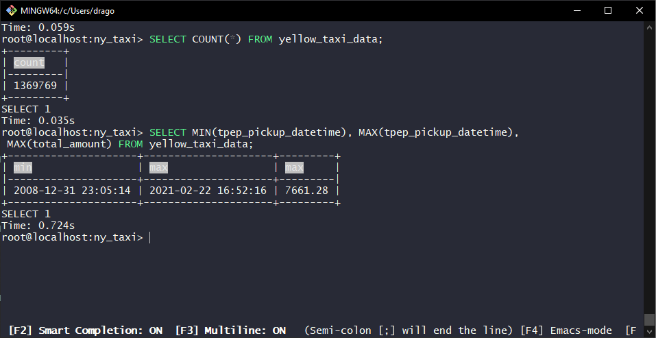

# Docker + Postgres

## Table of contents
+ [Introduction to Docker](#movie_camera-introduction-to-docker)
+ [Ingesting NY Taxi Data to Postgres](#movie_camera-ingesting-ny-taxi-data-to-postgres)
+ [Connecting pgAdmin and Postgres](#movie_camera-connecting-pgadmin-and-postgres)

---
## :movie_camera: Introduction to Docker

| [Link to video](https://www.youtube.com/watch?v=EYNwNlOrpr0&list=PL3MmuxUbc_hJed7dXYoJw8DoCuVHhGEQb) |

Let's define the simplest data pipeline: a Python script that reads data from a source, maybe a .csv file, and after doing something with the data (maybe some processing, maybe some cleaning), it writes the data to some database.


Of course, the data pipeline can include more than one source, it can have more than one script, etc.

Now let's focus on one particular step: some script that reads some data in .csv format and writes it to Postgres. We want to run it on our computer, the host machine; we can have multiple containers that we run with Docker, each managing a specific part of the whole process.

### Docker? 

Docker delivers software in packages, called containers, that are isolated from one another.

In our example, each container is isolated from the others, and all containers are isolated from the host machine; if we want to run our data pipeline on Ubuntu, we can run an Ubuntu container on our Windows machine and put in everything it needs to execute the script; if we want to write the output of our pipeline on a Postgres database without interfering with the Postgres database already installed on our host machine, we can run a docker container that will be our Postgres database, and we can even run a pgAdmin container that will connect to the Postgres database and let us perform all kinds of queries and operations.


Why is Docker so important?

+ _Reproducibility:_ that Ubuntu container that knows how to read a file in .csv format and write the result of its processing on a Postgres database is ready to be taken and ran into a completely different enviroment. Do we want to run it on the Cloud? We can, it's easy and immediate
+ _Local experiments...:_ we can quickly test our scripts and programs to make sure that their behaviour is exactly what we expect, without actually breaking anything in case what they're actually doing is _not_ what we expected.
+ _... and integration tests (CI/CD)_
+ _Running pipelines on the cloud_
+ _Serverless_


---

[^ Back to table of contents](#table-of-contents)

---
## :movie_camera: Ingesting NY Taxi Data to Postgres

| [Link to video](https://www.youtube.com/watch?v=2JM-ziJt0WI&list=PL3MmuxUbc_hJed7dXYoJw8DoCuVHhGEQb) |

### Setting up the server

We want to create a docker container that will run a postgres:13 image

```
winpty docker run -it \
    -e POSTGRES_USER="root" \
    -e POSTGRES_PASSWORD="root" \
    -e POSTGRES_DB="ny_taxi" \
    -v C://Users//[...]//dezoomcamp24//week1//docker_sql//ny_taxi_postgres_data:/var/lib/postgresql/data \
    -p 5432:5432 \
    --name pg-database \
    postgres:13
```
+ **-it** means that the container is in interactive mode: we can interact with the container's command prompt;

+ **-e** sets enviroment variables inside the container;

+ **-v** is used to mount a volume from the host machine to the container;

+ **-p** is used to map a container's port to a port on the host machine.

+ I am on a Windows enviroment, so in this situation I have to add the **winpty** command.


Now we have a database running in our docker container; note that, while the container is isolated, the postgres data is mounted on the path we specified; so, if we stop the container and run the command again, docker will correctly identify that the folder already contains the data.


### Setting up the client

Now that we have a server, we need to set up a new container that will act as our client. We're going to open a new Git Bash window and install pgcli.

```
pip install pgcli
```

Now that we've installed pgcli, we can run the following command to try and connect to our database:

```
winpty pgcli -h localhost -p 5432 -u root -d ny_taxi
```
+ **-h** sets the hostname of our Postgres server
+ **-p** sets the port number
+ **-u** is the username of the user trying to access
+ **-d** is the name of the database
+ **winpty** is winpty again

If everything went right, a connection to the database will be created and we can execute SQL commands.


If we now try to run a couple of queries, the database will obviously react as it's empty. Because it is. We can still SELECT 1; to ensure that the database is receiving queries from our client, and is replying as we expect.


### Setting up a pipeline

Now we have a server that can store our data, and we have a client that can read it. We now need something that can handle the transfer of the data from our dataset to our newly set up database; in this case, we're going to use Jupyter Notebook.

```
pip install jupyter
```

And now that we have Jupyter, we can run the command

```
jupyter notebook
```

to open the Jupyter Notebook editor. Let's create a new notebook and run a couple of tests to see if everything acts as we expect.


Now let's take a look at the dataset we actually need to use. The links are found in the official [dezoomcamp repository](https://github.com/DataTalksClub/data-engineering-zoomcamp/tree/main/01-docker-terraform/2_docker_sql#ny-trips-dataset).

Important: the project was created using .CSV files, and while the official link now has the data in .PARQUET format, the DataTalksClub has a copy of the original .CSV file. However, since I have practice with opening and handling .CSV files, I decided to use the .PARQUET file and get a little practice with the pyarrow library.

(As I write this, I _immediately_ encounter an error: apparently I can import pyarrow.parquet as pq and use it, but I cannot import pyarrow as pa and then use pa.parquet. The reason for this apparent inconsistency can be found [here](https://github.com/modin-project/modin/issues/951))


If everything works correctly, we will successfully read our data with Pandas.


Now that the data has been loaded from the source into Pandas, we need to move it from Pandas into our Postgres database. Of course, to be able to insert into our database, we will need to first establish a connection with it.

I'm going to import create_engine from sqlalchemy (visible in the first cell) and then we can use our credentials to connect with our docker container.


We can now write an instruction that will load the column names and types to create the schema we need in our Postgres database.


Now we have another problem: we could _try_ to do one million three hundred sixty nine thousand inserts at the same time... but it might be better if we batch it.
Since I'm using the .PARQUET file, I wrote this code to handle the difference in formats.


### Finishing touches

We did it! We successfully read from a .PARQUET file and wrote into a database... or did we? Let's check by going back to our client Git Bash terminal and trying to see which tables, if any, are present in our ny_taxi database, and how many rows the database has.


:D We have succesfully loaded the data into the Postgres database!

---

[^ Back to table of contents](#table-of-contents)

---
## :movie_camera: Connecting pgAdmin and Postgres
| [Link to video](https://www.youtube.com/watch?v=hCAIVe9N0ow&list=PL3MmuxUbc_hJed7dXYoJw8DoCuVHhGEQb) |

Now that we have loaded the data, we can explore it a little bit. For example, we can see the datetime for the first pickup contained in the database, the date for the last pickup, and the maximum amount ever paid.



7k dollars! Well, that must have been a trip! We don't know if those are mistakes or actual records, we might need to analyze the dataset to see if those are extreme outliers that might be best to exclude from a careful analysis.

However, the terminal is not the best interface. Shall we use docker to run a pdAdmin container as our client?

```
winpty docker run -it \
    -e PGADMIN_DEFAULT_EMAIL="admin@admin.com" \
    -e PGADMIN_DEFAULT_PASSWORD="root" \
    -p 8080:80 \
    dpage/pgadmin4
```

After we run this command in yet again another Git Bash terminal, this is my current predicament:


After filling the necessary fields to make pgAdmin connect to the database, we realize that the pgAdmin container and the server container cannot actually see each other, as they are running each in their own container.

The solution? We need to run a docker container that creates a network, and then we need to run the server container and the pdAdmin container _inside_ this container.

To assist in the understanding of the concept, I made a very detailed and very instructive drawing in powerpoint.


### Setting up the network of containers

It's easier than it sounds like: we just need to stop all the containers, create a new docker container by running the command:

```
winpty docker network create pg-network
```

And then we can run our server and pgAdmin containers again, adding a name (to easily identify the container) and which network they're part of.

```
winpty docker run -it \
    -e POSTGRES_USER="root" \
    -e POSTGRES_PASSWORD="root" \
    -e POSTGRES_DB="ny_taxi" \
    -v /c/Users/drago/Documents/GitHub/dezoomcamp24/week1/docker_sql/ny_taxi_postgres_data:/var/lib/postgresql/data \
    -p 5432:5432 \
    --network=pg-network \
    --name pg-database \
    postgres:13
```

```
winpty docker run -it \
    -e PGADMIN_DEFAULT_EMAIL="admin@admin.com" \
    -e PGADMIN_DEFAULT_PASSWORD="root" \
    -p 8080:80 \
    --network=pg-network \
    --name pgadmin \
    dpage/pgadmin4
```

Finally, we can access the server container from our client container.


---

[^ Back to table of contents](#table-of-contents)

---
## :movie_camera: Putting the ingestion script into Docker
| [Link to video](https://www.youtube.com/watch?v=B1WwATwf-vY&list=PL3MmuxUbc_hJed7dXYoJw8DoCuVHhGEQb) |

(Work in progress)

## :movie_camera: Running Postgres and pgAdmin with Docker-Compose
| [Link to video](https://www.youtube.com/watch?v=hKI6PkPhpa0&list=PL3MmuxUbc_hJed7dXYoJw8DoCuVHhGEQb) |

We have seen how to create containers separately, and then how to create a network container and connected them to it. Instead of doing this by hand, we can specify one YAML file with config for all containers, and then just run that.

