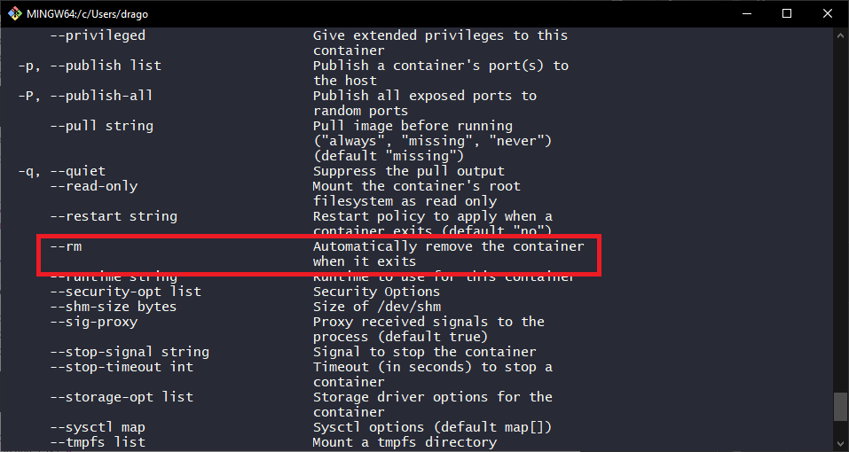
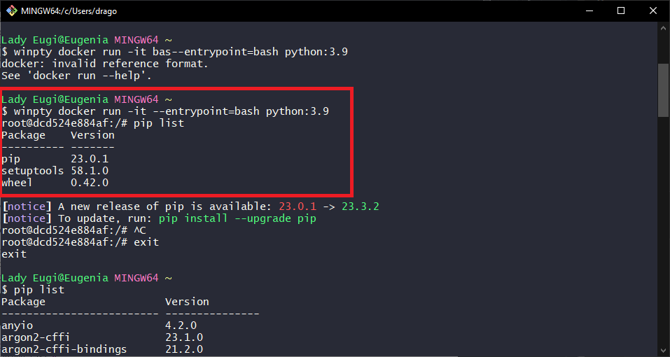
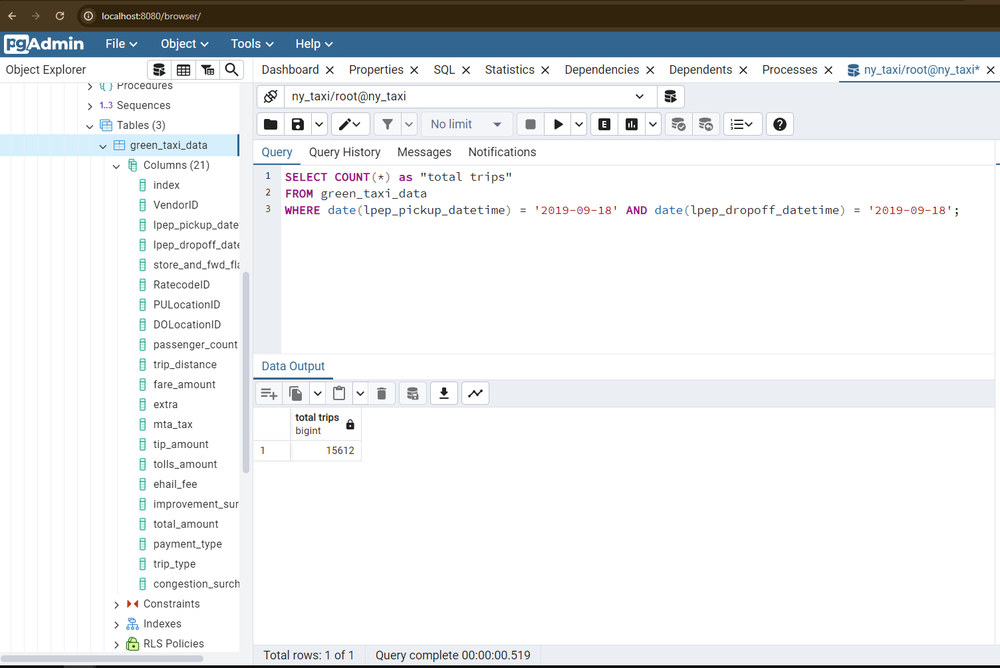
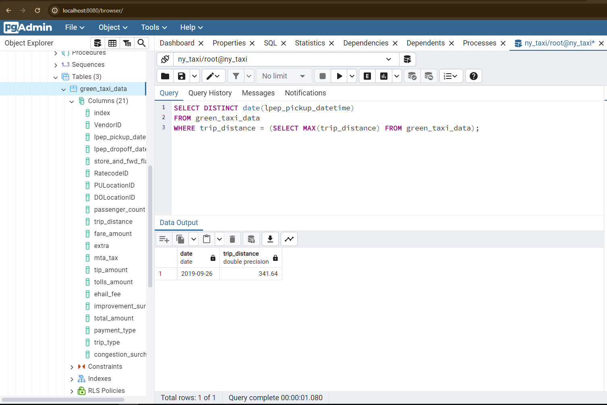
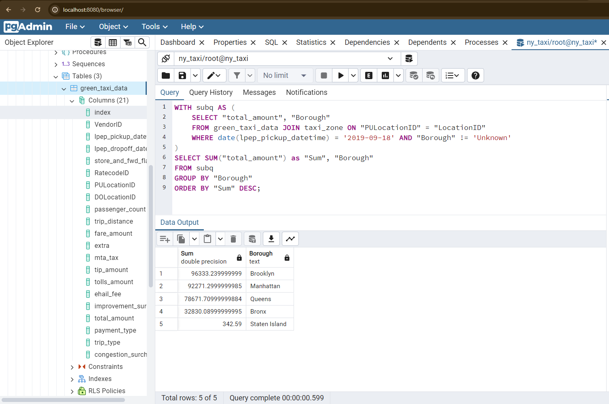
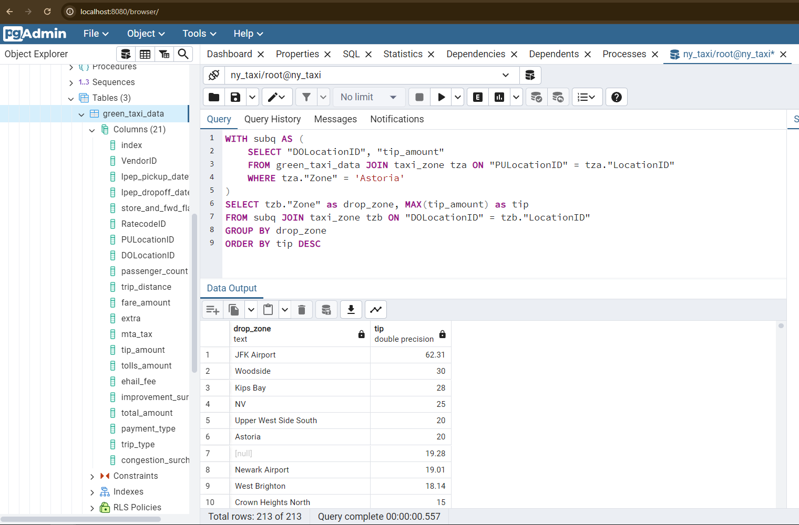

# Homework Week 1

To execute the queries needed to answer questions 3 to 6, I wrote the script contained in the [Jupyter Notebook homework.ipynb](https://github.com/niaBaldoni/dezoomcamp24/blob/main/week1/Homework.ipynb) to load both the green taxi trips (September 2019) and zones datasets onto my dockerized Postgres database.

To answer question 7, I used the [main.tf](https://github.com/niaBaldoni/dezoomcamp24/blob/main/week1/terraform_gcp/terrademo/main.tf) and [variables.tf](https://github.com/niaBaldoni/dezoomcamp24/blob/main/week1/terraform_gcp/terrademo/variables.tf) files contained in the /terraform/terrademo folder.

## Question 1

I executed three commands: ```docker --help```, ```docker build --help``` and ```docker run --help```. The text

> Automatically remove the container when it exits

was found in the ```docker run --help``` section, ```--rm``` option  as indicated by the following screen.



---
## Question 2

I executed the following command to create a Python 3.9 container: 

```winpty docker run -it --entrypoint=bash python:3.9```

Thanks to the -it option, we can now easily write the ```pip list``` command and obtain a list of the python modules present in the container. As we can see, the package wheel is **version 0.42.0**.



---
## Question 3
> How many taxi trips were totally made on September 18th 2019?

My query:

```
SELECT COUNT(*) 
FROM green_taxi_data
WHERE date(lpep_pickup_datetime) = '2019-09-18' AND date(lpep_dropoff_datetime) = '2019-09-18';
```
Answer: there were **15612** trips started and completed on date 2019-09-18.



---
## Question 4

> Which was the pick up day with the longest trip distance? 

My query:

```
SELECT DISTINCT date(lpep_pickup_datetime) 
FROM green_taxi_data
WHERE trip_distance = (SELECT MAX(trip_distance) FROM green_taxi_data);
```
Answer: the day with the longest trip was on date **2019-09-26**.



---
## Question 5
> Which were the 3 pick up Boroughs that had a sum of total_amount superior to 50000?

My query:

```
WITH subq AS (
	SELECT "total_amount", "Borough"
	FROM green_taxi_data JOIN taxi_zone ON "PULocationID" = "LocationID"
	WHERE date(lpep_pickup_datetime) = '2019-09-18' AND "Borough" != 'Unknown'
)
SELECT SUM("total_amount") as "Sum", "Borough"
FROM subq
GROUP BY "Borough"
ORDER BY "Sum" DESC;
```
Answer: the 3 pickup Boroughs that had a sum of total_amount superior to 50000 were **Brooklyn, Manhattan and Queens**



---
## Question 6
> For the passengers picked up in September 2019 in the zone name Astoria which was the drop off zone that had the largest tip?

My query:

```
WITH subq AS (
    SELECT "DOLocationID", "tip_amount"
    FROM green_taxi_data JOIN taxi_zone tza ON "PULocationID" = tza."LocationID"
    WHERE tza."Zone" = 'Astoria'
)
SELECT tzb."Zone" as drop_zone, MAX(tip_amount) as tip
FROM subq JOIN taxi_zone tzb ON "DOLocationID" = tzb."LocationID"
GROUP BY drop_zone
ORDER BY tip DESC
```

Answer: the drop off zone that had the largest tip was **JFK Airport**.



---
## Question 7


```
Terraform used the selected providers to generate the following execution
plan. Resource actions are indicated with the following symbols:
  + create

Terraform will perform the following actions:

  # google_bigquery_dataset.demo_dataset will be created
  + resource "google_bigquery_dataset" "demo_dataset" {
      + creation_time              = (known after apply)
      + dataset_id                 = "demo_dataset"
      + default_collation          = (known after apply)
      + delete_contents_on_destroy = false
      + effective_labels           = (known after apply)
      + etag                       = (known after apply)
      + id                         = (known after apply)
      + is_case_insensitive        = (known after apply)
      + last_modified_time         = (known after apply)
      + location                   = "EU"
      + max_time_travel_hours      = (known after apply)
      + project                    = "perfect-science-412620"
      + self_link                  = (known after apply)
      + storage_billing_model      = (known after apply)
      + terraform_labels           = (known after apply)
    }

  # google_storage_bucket.this-is-a-demo-bucket will be created
  + resource "google_storage_bucket" "this-is-a-demo-bucket" {
      + effective_labels            = (known after apply)
      + force_destroy               = true
      + id                          = (known after apply)
      + location                    = "EU"
      + name                        = "perfect-science-412620-demo-bucket"
      + project                     = (known after apply)
      + public_access_prevention    = (known after apply)
      + rpo                         = (known after apply)
      + self_link                   = (known after apply)
      + storage_class               = "STANDARD"
      + terraform_labels            = (known after apply)
      + uniform_bucket_level_access = (known after apply)
      + url                         = (known after apply)

      + lifecycle_rule {
          + action {
              + type = "AbortIncompleteMultipartUpload"
            }
          + condition {
              + age                   = 1
              + matches_prefix        = []
              + matches_storage_class = []
              + matches_suffix        = []
              + with_state            = (known after apply)
            }
        }
    }

Plan: 2 to add, 0 to change, 0 to destroy.

Do you want to perform these actions?
  Terraform will perform the actions described above.
  Only 'yes' will be accepted to approve.

  Enter a value:

```