# Docker + Postgres

## Introduction to Docker

Docker:
+ delivers software in packages called containers
+ containers are isolated from one another
+ (smarter notes will come later this week)

## Ingesting NY Taxi Data to Postgres

### Setting up the server

We want to create a docker container that will run a postgres:13 image

```
winpty docker run -it \
    -e POSTGRES_USER="root" \
    -e POSTGRES_PASSWORD="root" \
    -e POSTGRES_DB="ny_taxi" \
    -v C://Users//[...]//dezoomcamp24//week1//docker_sql//ny_taxi_postgres_data:/var/lib/postgresql/data \
    -p 5432:5432 \
    --name pg-database \
    postgres:13
```
+ **-it** means that the container is in interactive mode: we can interact with the container's command prompt;

+ **-e** sets enviroment variables inside the container;

+ **-v** is used to mount a volume from the host machine to the container;

+ **-p** is used to map a container's port to a port on the host machine.

+ I am on a Windows enviroment, so in this situation I have to add the **winpty** command.

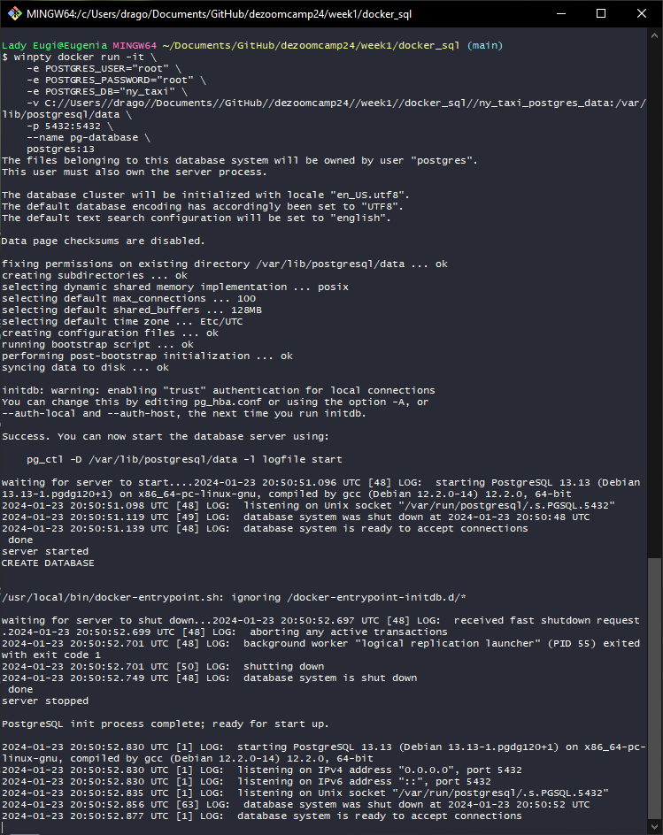

Now we have a database running in our docker container; note that, while the container is isolated, the postgres data is mounted on the path we specified; so, if we stop the container and run the command again, docker will correctly identify that the folder already contains the data.

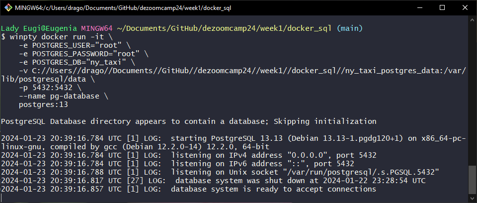

### Setting up the client

Now that we have a server, we need to set up a new container that will act as our client. We're going to open a new Git Bash window and install pgcli.

```
pip install pgcli
```

Now that we've installed pgcli, we can run the following command to try and connect to our database:

```
winpty pgcli -h localhost -p 5432 -u root -d ny_taxi
```
+ **-h** sets the hostname of our Postgres server
+ **-p** sets the port number
+ **-u** is the username of the user trying to access
+ **-d** is the name of the database
+ **winpty** is winpty again

If everything went right, a connection to the database will be created and we can execute SQL commands.

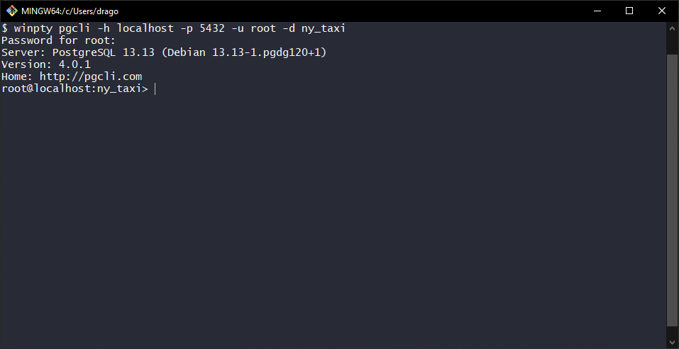

If we now try to run a couple of queries, the database will obviously react as it's empty. Because it is. We can still SELECT 1; to ensure that the database is receiving queries from our client, and is replying as we expect.

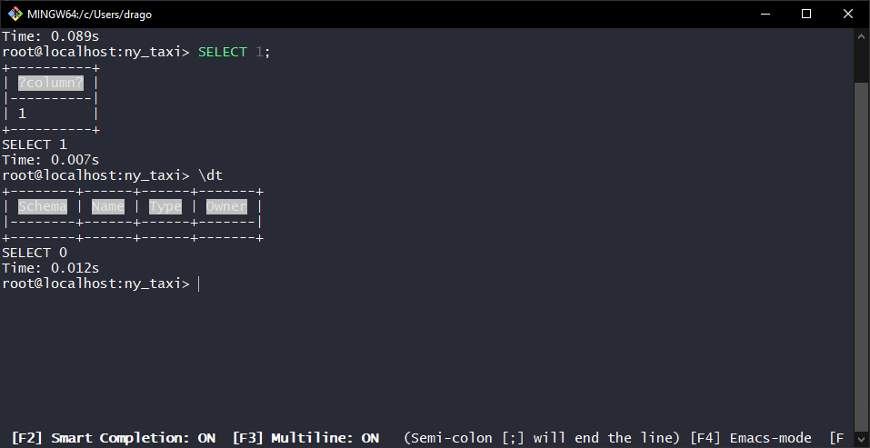

### Setting up a pipeline

Now we have a server that can store our data, and we have a client that can read it. We now need something that can handle the transfer of the data from our dataset to our newly set up database; in this case, we're going to use Jupyter Notebook.

```
pip install jupyter
```

And now that we have Jupyter, we can run the command

```
jupyter notebook
```

to open the Jupyter Notebook editor. Let's create a new notebook and run a couple of tests to see if everything acts as we expect.

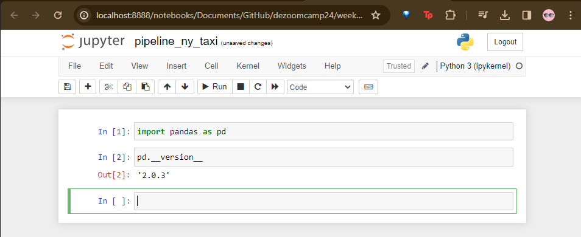

Now let's take a look at the dataset we actually need to use. The links are found in the official [dezoomcamp repository](https://github.com/DataTalksClub/data-engineering-zoomcamp/tree/main/01-docker-terraform/2_docker_sql#ny-trips-dataset).

Important: the project was created using .CSV files, and while the official link now has the data in .PARQUET format, the DataTalksClub has a copy of the original .CSV file. However, since I have practice with opening and handling .CSV files, I decided to use the .PARQUET file and get a little practice with the pyarrow library.

(As I write this, I _immediately_ encounter an error: apparently I can import pyarrow.parquet as pq and use it, but I cannot import pyarrow as pa and then use pa.parquet. The reason for this apparent inconsistency can be found [here](https://github.com/modin-project/modin/issues/951))

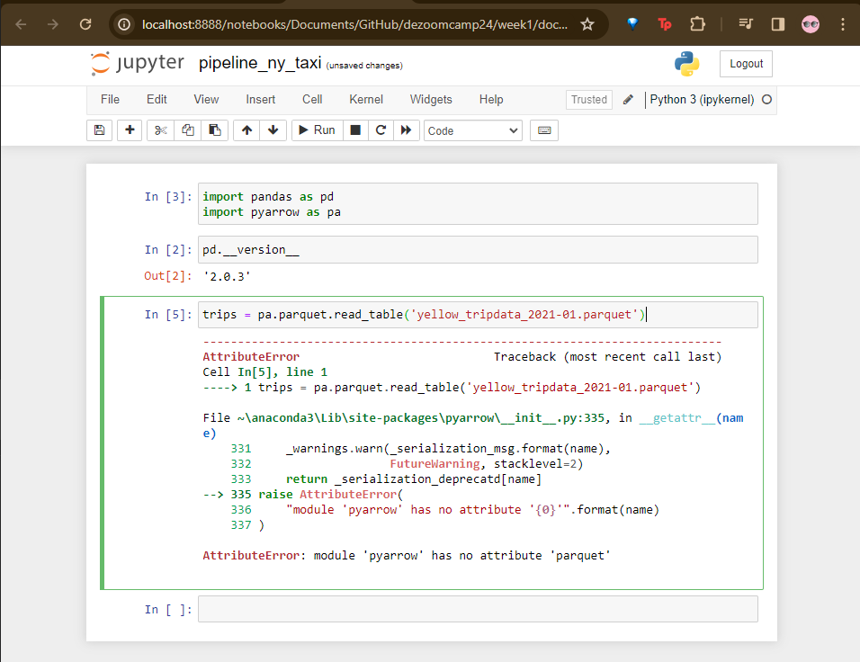

If everything works correctly, we will successfully read our data with Pandas.

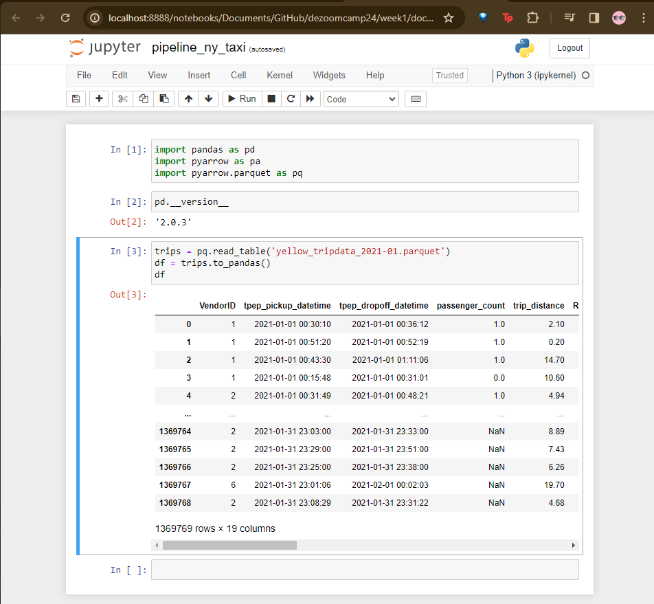

Now that the data has been loaded from the source into Pandas, we need to move it from Pandas into our Postgres database. Of course, to be able to insert into our database, we will need to first establish a connection with it.

I'm going to import create_engine from sqlalchemy (visible in the first cell) and then we can use our credentials to connect with our docker container.

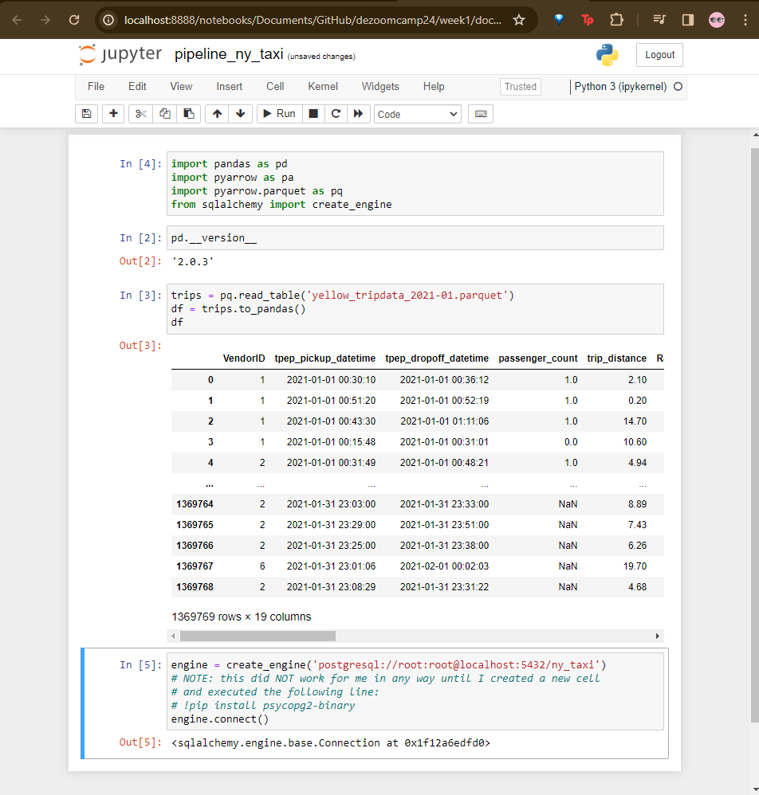

We can now write an instruction that will load the column names and types to create the schema we need in our Postgres database.

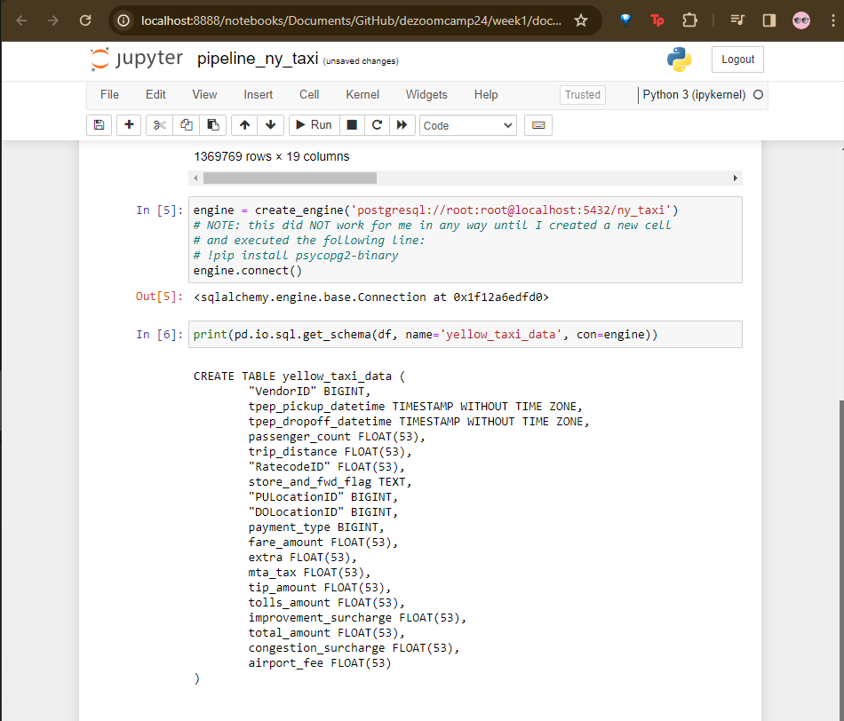

Now we have another problem: we could _try_ to do one million three hundred sixty nine thousand inserts at the same time... but it might be better if we batch it.
Since I'm using the .PARQUET file, I wrote this code to handle the difference in formats.

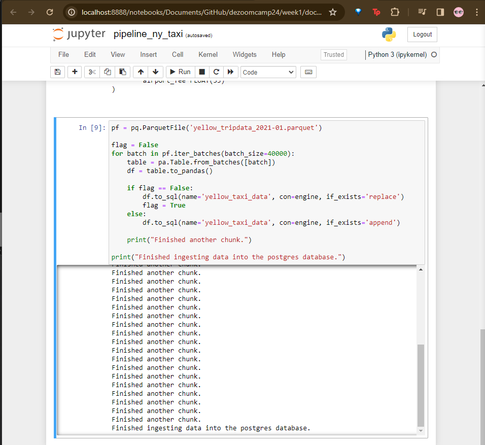

### Finishing touches

We did it! We successfully read from a .PARQUET file and wrote into a database... or did we? Let's check by going back to our client Git Bash terminal and trying to see which tables, if any, are present in our ny_taxi database, and how many rows the database has.

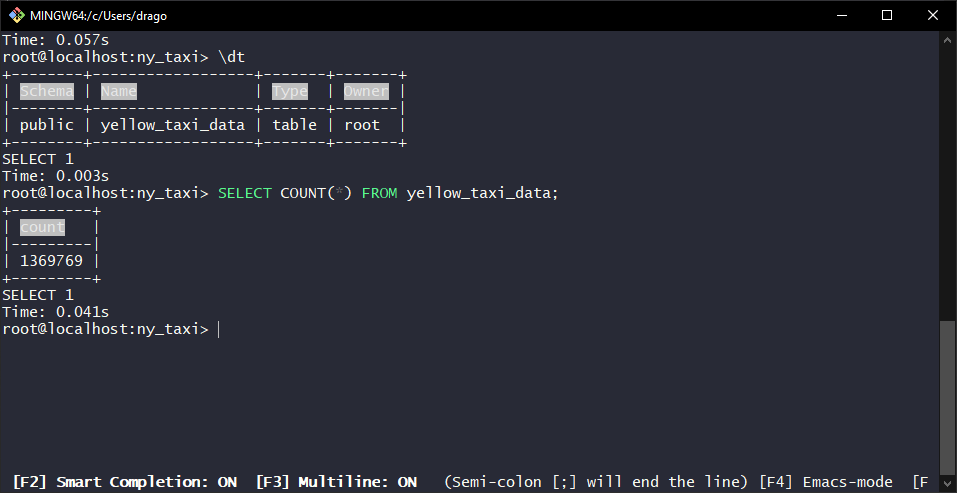

:D We have succesfully loaded the data into the Postgres database!
